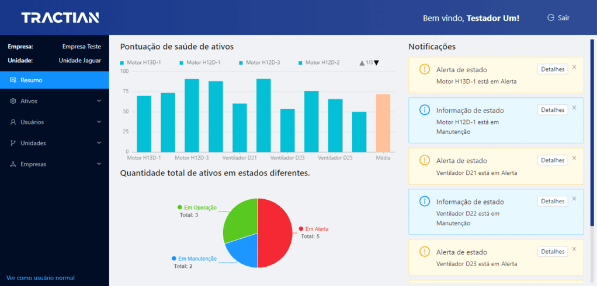

<h1 align="center">
   Tractian Test
</h1>

<p align="center">
  
  
  
  
</p>



<h4 align="center">
<i>"Construir uma aplicação que mostre todos os dados e ações possíveis que utilizam a API criada no desafio back-end."</i>
</h4>

### 🤩 Acesso

Acesso pelo link: [Tractian-Test](https://tractian-test.vercel.app/)

### 🗻 Pré-requisitos

Antes de começar, você vai precisar ter instalado em sua máquina as seguintes ferramentas:
[Git](https://git-scm.com) e o [Node.js](https://nodejs.org/en/).
Além disto é bom ter um editor para trabalhar com o código como [VSCode](https://code.visualstudio.com/)

```bash
# Clone este repositório
$ git clone https://github.com/azevgabriel/tractian_test.git

# Acesse a pasta do projeto no terminal/cmd
$ cd tractian_test

# Instale as dependências
$ yarn

# Inicie o serviço
$ yarn dev
```

### ✨ Tecnologias

As seguintes ferramentas foram usadas na construção do projeto:

- [Typescript](https://www.typescriptlang.org/)
- [Yarn](https://yarnpkg.com/)
- [React](https://pt-br.reactjs.org/)
- [React-Router](https://reactrouter.com/)
- [Vite](https://vitejs.dev/)
- [Ant Design](https://ant.design/)
- [Ant Design Charts](https://charts.ant.design/zh)

### Contribuidores

<table>
  <tr>
    <td align="center">
      <a href="https://github.com/azevgabriel">
        <br>
        <sub>
          <b>Gabriel Azevedo</b>
        </sub>
      </a>
    </td>
  </tr>
</table>
